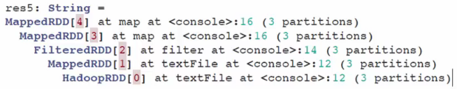

## Part II: Resilient Distributed Datasets


- Spark's primary data abstraction
- How to create parallelized collections and external datasets
- RDD Operations: Transformations and Actions
- Shared variables and K-V pairs


RDDs are a **fault-tolerant** collection of elements that can be parallelized, and they are **immutable**. When a RDD is created, a **Direct Acyclic Graph** is created as well

- Parallelizing an existing collection

  ```python
  data = 1..100
  distData = sc.parallelize(data)
  # A Hadoop InputFormat
  readmeFile = sc.textFile("README.md")
  # Or from HaDoop File System
  lines = sc.textFile("hdfs://data.text")
  ```

- Referencing a dataset `sc.`

- Transformation from an existing RDD

  ```python
  distData.filter(lambda x: x == "Hello world")
  ```

  

These graphs can be replayed on nodes that need to get back to the state it was before it went offline - thus providing fault tolerance.

Spark supports **any Hadoop InputFormat**. 


----

A DAG is essentially a graph of the bussiness logic and does not get executed until an action is called (*lazy evaluation*).

`toDebugString()`

It shows a String of operations on the RDD nodes



That allows for fault tolerance: if anode goes offline and comes back on, all it has todo is just **grab a copy** of this from a neighboring node and **rebuild the graph** back to where it was before itw ent offline.


>  The MapReduce architecture allows to split the worlkload among the workers, which computes the transformation (either from `HDFS` or from cache/local worker memory, if cached: `rdd.cache()`), and returns the result of the action to the driver/master

- map
- filter
- flatMap
- join: $<K,V> \times <K,W> \ \rightarrow\ <K,(V,W)>$
- reduceByKey
- sortByKey


- collect()
- count()
- first()
- take(n)
- foreach(func)


#### RDD Persistence

Basically, `persist()` and `cache()`: any node stores a partition of the dataset and computes it in memory. When a subsequent action is called on the same dataset, or a derived dataset, it uses it from memory instead of having to retrieve it again.

As said before, caching is fault tolerant, because if any data is lost, it can be automatically recomputed throughout the DAG.

`cache` = `persist(MEMORY_ONLY)`, which stores the data as deserialized Java objects, which are faster to read.


- If the RDDs fit comfortably with the default storage level (`MEMORY_ONLY`), which is RAM, stick with that
- If not, use `MEMORY_ONLY_SER` and select a fast seralization library.
- Use replicated storage levels if you want fast fault recovery
- If running an environment with high amount of RAM memory or multiple applications, go ahead with `OFF_HEAP` mode and *Tachyon*.

#### Spark shared variables

Common usage patterns

- Broadcasts :arrow_right: read-only variable

  -  

  Useful for *broadcasting* variables from the driver/master to each worker so that each worker can compute on a separate copy

- Accumulators :arrow_right: global variable

  - Only the driver/master can read from accumulator variables
  - Useful to implement counters or sums; they're used as objects in the tasks/workers for parallel computing.

- Key-Value Pairs

  `pair = ('a', 1); pair[0]`

  `val pair = ('a', 'b'); pair._1`

  `Tuple2 pair = new Tuple2('a','b'); pair._1`

It is useful to apply transformations on $<K,V>$ pairs, as it is easier to group or aggregate elements by a key. Thought, every object implemented as $<K,V>$ pair needs of a `equals()` and a `hashCode()`  method.